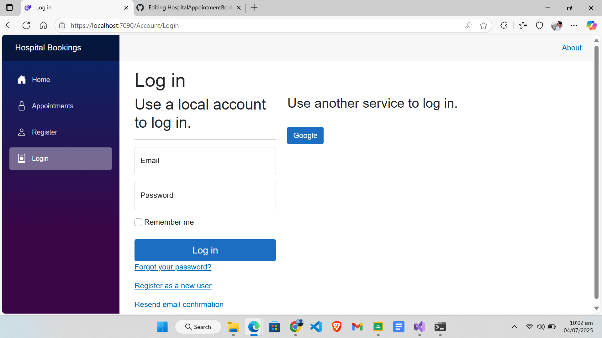
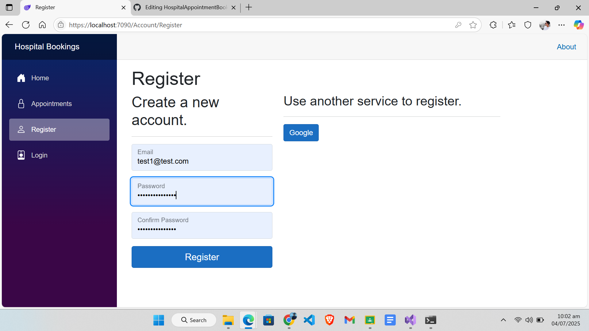
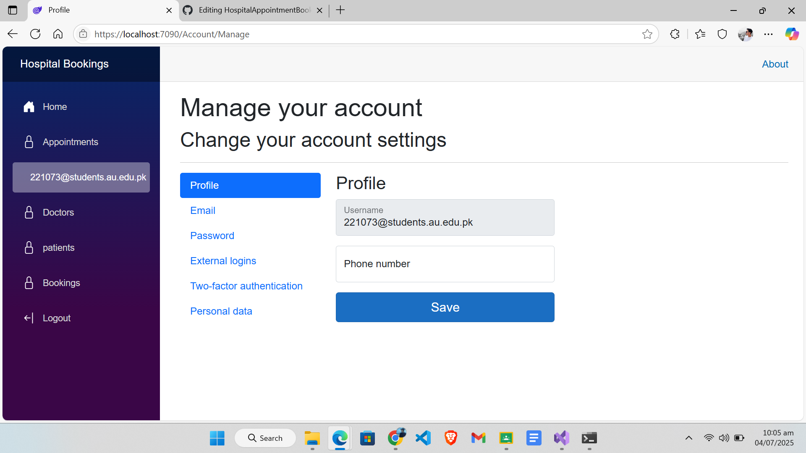
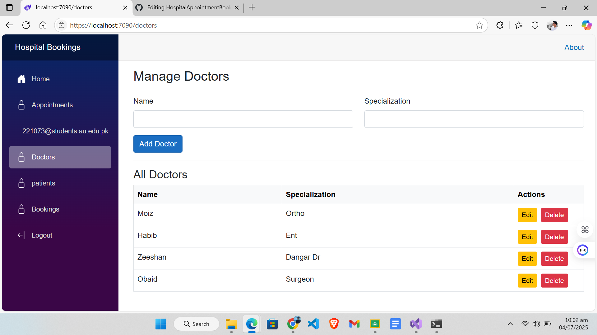
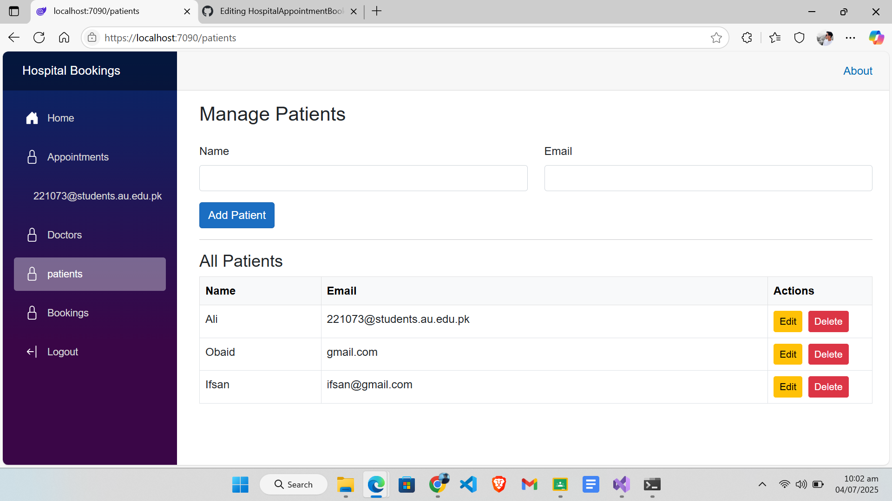
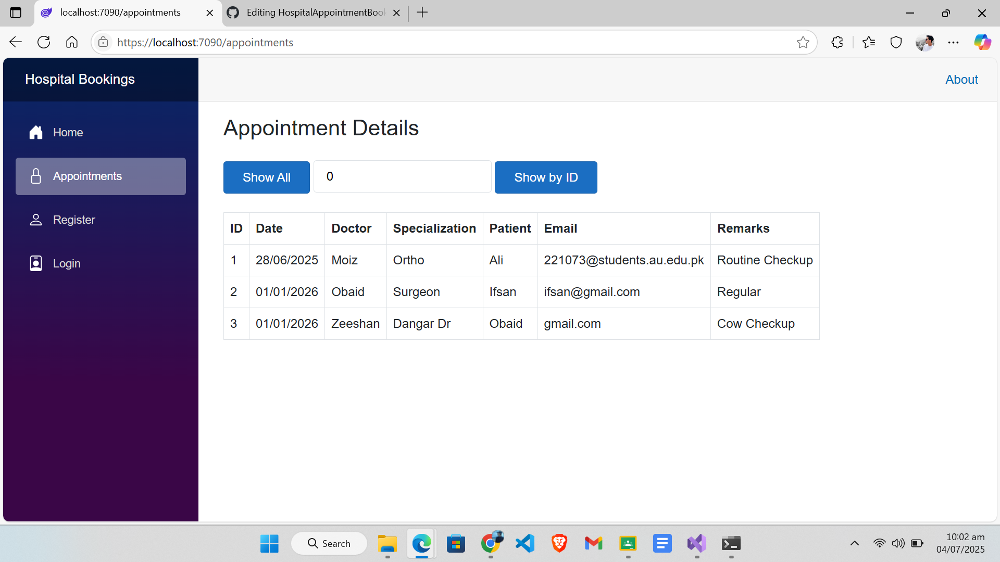
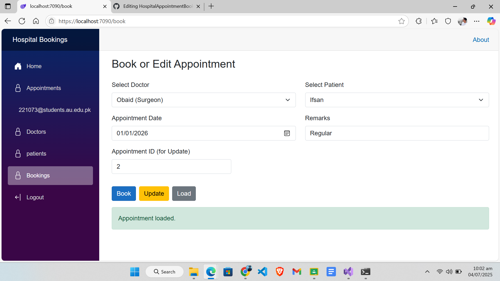
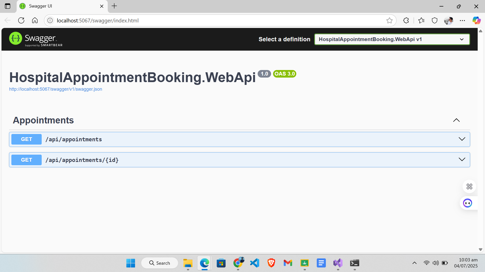
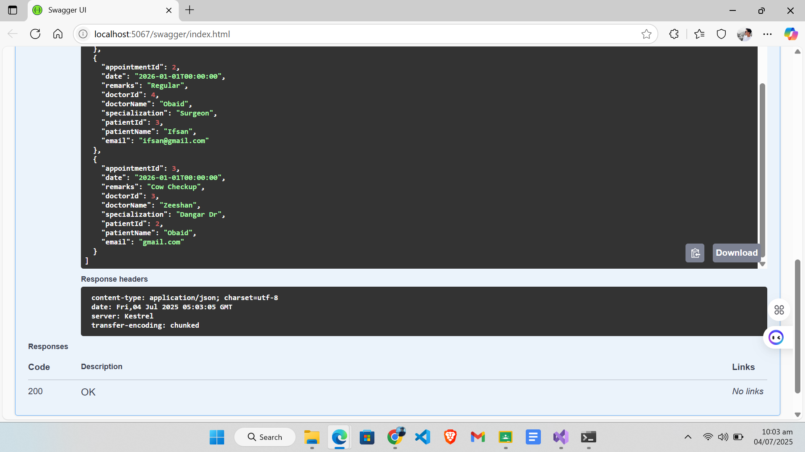

# 🏥 Hospital Appointment Booking

A full-featured **Blazor Server** application to manage hospital appointments, built with clean 3-tier architecture, SQL Server integration, and Google OAuth authentication.

---

## 📌 Project Overview

This project enables both patients and staff to view, create, update, and manage appointments via a modern, responsive UI. Key features include:

- Modular, reusable UI components with **Blazor Server**
- Two-way data binding and event handling
- Page navigation and authentication-based access control
- MS SQL Server backend with normalized tables and constraints
- Full CRUD operations using **ADO.NET** within a 3-tier layer-based architecture
- A separate module consuming a **RESTful ASP.NET Core Web API** via `HttpClient`
- **Google Sign-In** powered by ASP.NET Core Identity and OAuth 2.0
- Validation, responsive design, and consistent navigation

---

## 🛠️ Technologies & Architecture

| Area            | Technology / Tools |
|----------------|--------------------|
| Frontend       | Blazor Server with Bootstrap |
| Backend API    | ASP.NET Core Web API |
| Data Access    | ADO.NET (`SqlConnection`, `SqlCommand`, `SqlDataReader`) |
| Database       | Microsoft SQL Server |
| Auth           | ASP.NET Core Identity + Google OAuth |
| Validation/UI  | Data annotations, Bootstrap forms |

**Layered Architecture**
- **Presentation (UI)**: Blazor components & pages
- **Business Logic Layer (BLL)**: Service classes to enforce rules
- **Data Access Layer (DAL)**: Clean ADO.NET wrappers
- **Database**: At least three tables with PKs, FKs, constraints
- **Web API**: Separate appointment CRUD module

---

## 🔑 Features

- **CRUD Operations**
  - Full operations (Create, Read, Update, Delete) for at least two entities (`Doctors`, `Patients`) with ADO.NET in a 3-tier model.
  - `Appointments` module handled by a REST API (`GET`, `POST`, `PUT`, `DELETE`), consumed with `HttpClient`.

- **Authentication**
  - Users log in with Google via OAuth 2.0.
  - After login, user data (name, email, Google ID) is saved in the database if not already present.
  - Certain pages are protected using the `[Authorize]` attribute.

- **Responsive UI**
  - Bootstrap 5 ensures the application works smoothly on different screen sizes.
  - The layout uses `Flexbox` and a component-based design.

- **Form Validation**
  - Client-side and server-side validation using Blazor’s built-in data annotations and `ValidationSummary`.

---

## 🚀 Getting Started

### Prerequisites
- [.NET SDK 7 or higher](https://dotnet.microsoft.com/download)
- [SQL Server 2019 or higher](https://www.microsoft.com/sql-server)
- Visual Studio 2022 or newer

### Steps

1.  **Clone the repo:**
    ```bash
    git clone [https://github.com/codeWithMoez/HospitalAppointmentBooking.git](https://github.com/codeWithMoez/HospitalAppointmentBooking.git)
    cd HospitalAppointmentBooking
    ```

2.  **Configure SQL Server:**
    - Create the database manually or run the provided SQL scripts.
    - Ensure your connection string in `appsettings.json` is valid for both:
      - `HospitalAppointmentBooking.Blazor`
      - `HospitalAppointmentBooking.WebApi`

3.  **Set up Google OAuth Credentials:**
    - Visit the [Google Developer Console](https://console.developers.google.com/).
    - Create OAuth 2.0 credentials (Client ID and Secret).
    - In `appsettings.json`, add your credentials:
      ```json
      "Authentication": {
        "Google": {
          "ClientId": "your-google-client-id",
          "ClientSecret": "your-google-client-secret"
        }
      }
      ```

4.  **Run the Application:**
    - Open the solution file (`.sln`) in Visual Studio.
    - Set `HospitalAppointmentBooking.Blazor` as the startup project.
    - Ensure both the Blazor and Web API projects are configured to run simultaneously.
    - Press F5 or the "Run" button to launch the application.
    - Navigate to `https://localhost:5001` (or the port shown in your launch settings).

---

## 📂 Project Structure

HospitalAppointmentBooking/
├── HospitalAppointmentBooking.Blazor/      \# Blazor Server App (Presentation Layer)
├── HospitalAppointmentBooking.WebApi/      \# RESTful API for Appointment Module
├── HospitalAppointmentBooking.Application/ \# Business Logic Layer (BLL)
├── HospitalAppointmentBooking.DataAccess/  \# ADO.NET (DAL)
├── HospitalAppointmentBooking.Domain/      \# Entity Models
├── HospitalAppointmentBooking.Infrastructure/ \# Identity & Google Login
└── README.md

## 📸 Screenshots

Here are some snapshots of the application in action.

### Authentication & User Flow
* **Login Page**: Users can sign in using their Google account.
    
* **Registration Page**: New user details are captured upon first login.
    
* **Home Page (After Login)**: The main landing page after a user is authenticated.
    

### Core Application Features
* **Doctors Management**: View and manage the list of available doctors (CRUD).
    
* **Patients Management**: View and manage the list of registered patients (CRUD).
    
* **Appointments Dashboard**: View all scheduled appointments.
    
* **Booking an Appointment**: The form for creating a new appointment.
    

### Web API
* **API Endpoints**: A look at the defined API endpoints for appointments.
    
* **API Testing**: Demonstrating a successful API call.
    

#### 🔒 Google Login
#### 👨‍⚕️ Doctor CRUD
#### 📅 Appointment API

## 🙌 Acknowledgements
- [Microsoft Docs – Blazor Server](https://docs.microsoft.com/en-us/aspnet/core/blazor/?view=aspnetcore-7.0)
- [Google OAuth Docs](https://developers.google.com/identity/protocols/oauth2)
- [Bootstrap Documentation](https://getbootstrap.com/docs/5.3/getting-started/introduction/)

A big thanks to all the tutorials and documentation that helped make this project possible!


## 📬 Contact

**Moeiz**

- 🔗 **GitHub**: [@codeWithMoez](https://github.com/codeWithMoez)
- ✉️ **Email**: 221073@students.au.edu.pk

⭐ Don’t forget to star the repo if you found this project helpful!
